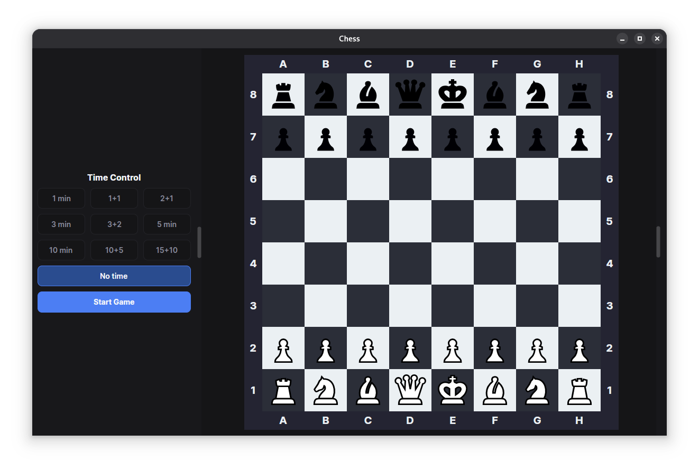
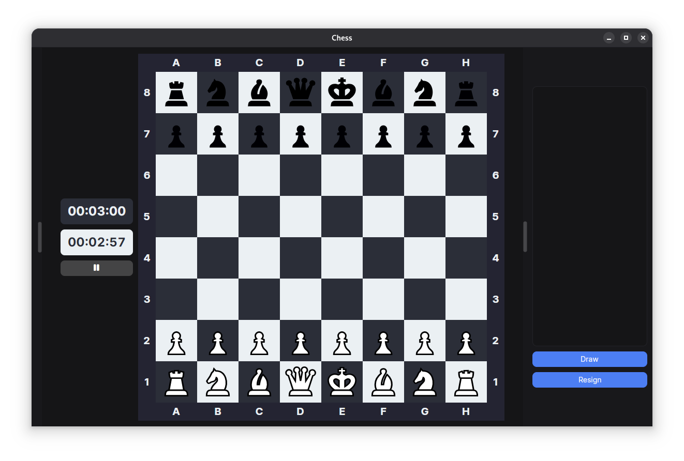
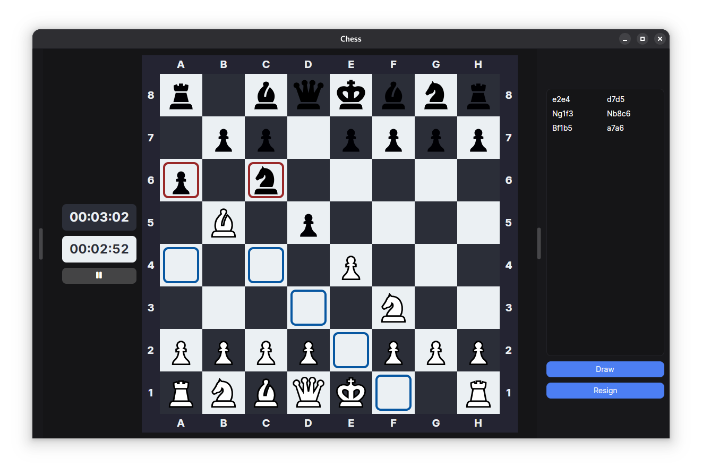

# Chess on C#

## Architecture
- Chess.Core holds the game logic (pieces, board, check/pin state, clock, move history)
- Chess.Ui is an Avalonia MVVM front end
- Chess.Tests is xUnit v3.
- Move legality is computed through CheckState (attackers, blocking squares) and pin tracking (DetectAndMarkPin), rather than by simulating each move and testing for check.

## Screenshots
### Time selection

### On game

### Available moves
